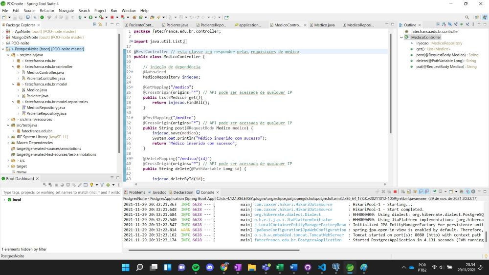
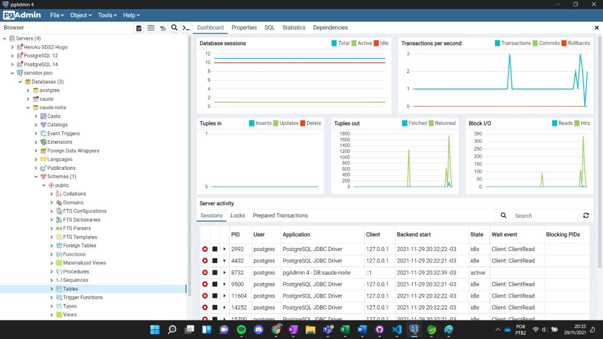
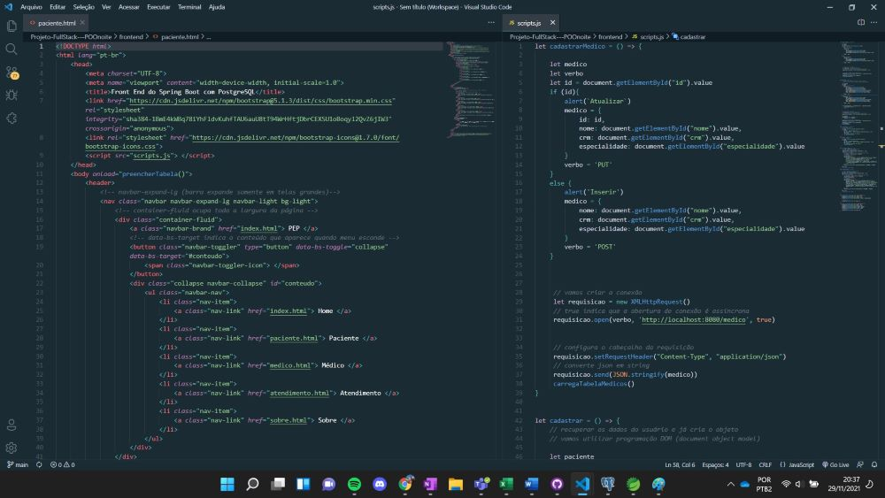
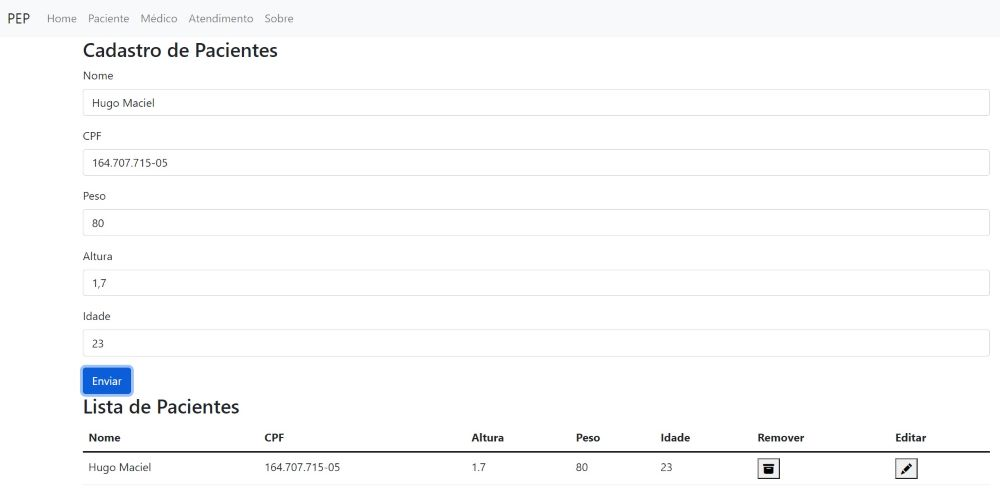

# Projeto FullStack POOnoite
Projeto FullStack utilizando Java Spring + Bootstrap5 + PostgreSQL

## API: Application Program Interface
	• Utilizado para comunicação entre sistemas;
	• JSON Web Token: Autorização para receber bancos
	• Integradoras recebem a chave API dos marketplaces para conseguir comunicação entre vendas/estoque do Seller

## Projeto de APIs
	- APIs RESTful:
		○ Construída sobre protocolo HTTP, baseada em JSON (Formato de documento)
	- Padrão de projeto MVC:
		○ Model (SQL)
		○ View (Front-End)
		○ Controller (APIs)
	- Apache Tomcat:
		○ Servidor web
		○ Servidor para aplicações Java

## Verbos da requisição
	- GET (GetMapping)
		○ Consultar
	- POST (@PostMapping)
		○ Inserir
	- DELETE (@DeleteMapping)
		○ Remover
	- PUT (@PutMapping)
		○ Atualizar objeto inteiro
	- PATCH (@PatchMapping)
		○ Atualizar um campo apenas do objeto

- [x] BackEnd: Java Spring Boot
<h1 align="center">
  
</h1>

- [x] Banco de dados: PostgreSQL
<h1 align="center">
  
</h1>

- [x] FrontEnd: HTML + BootStrap + JavaScript para manipulação de dados
<h1 align="center">
  
  
</h1>
